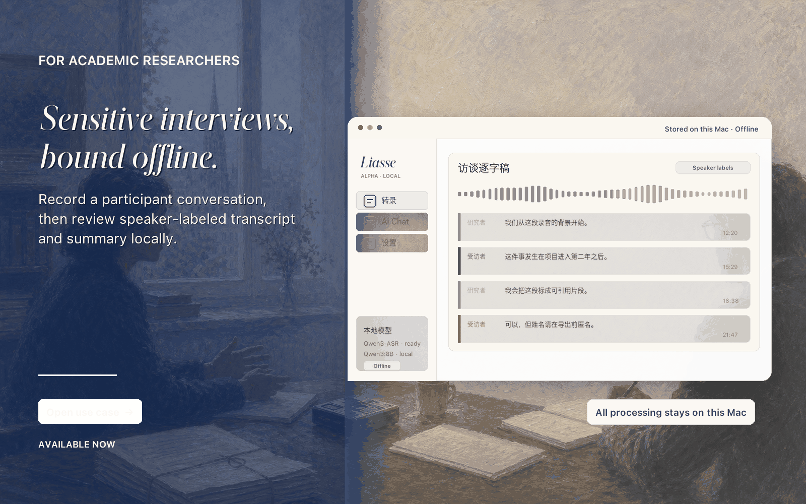
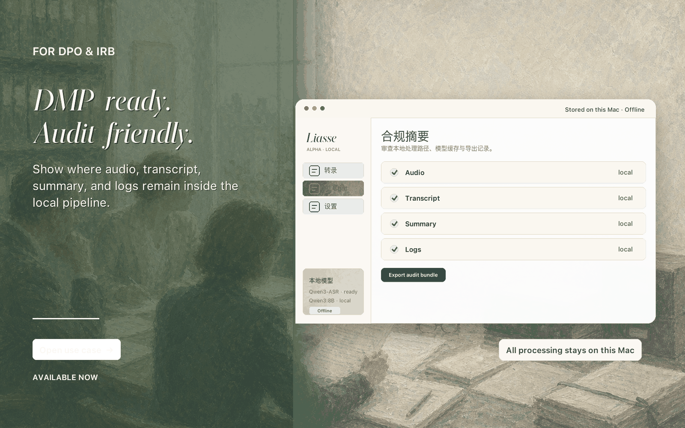
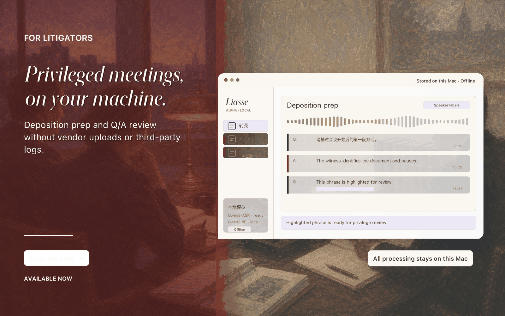
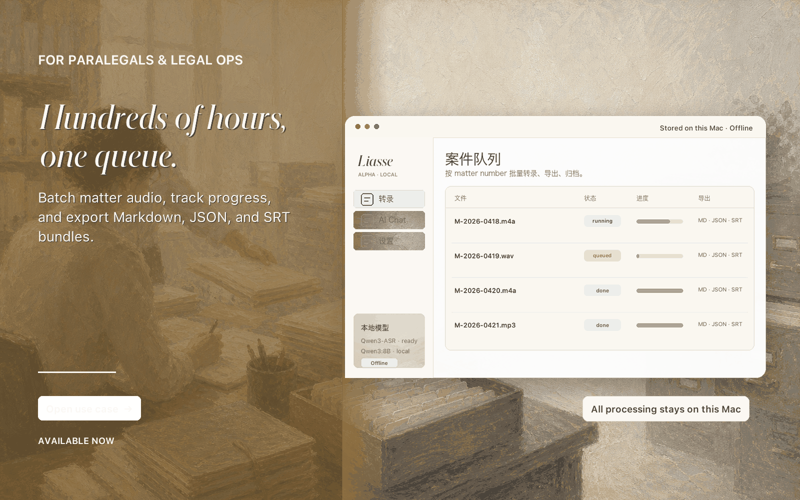
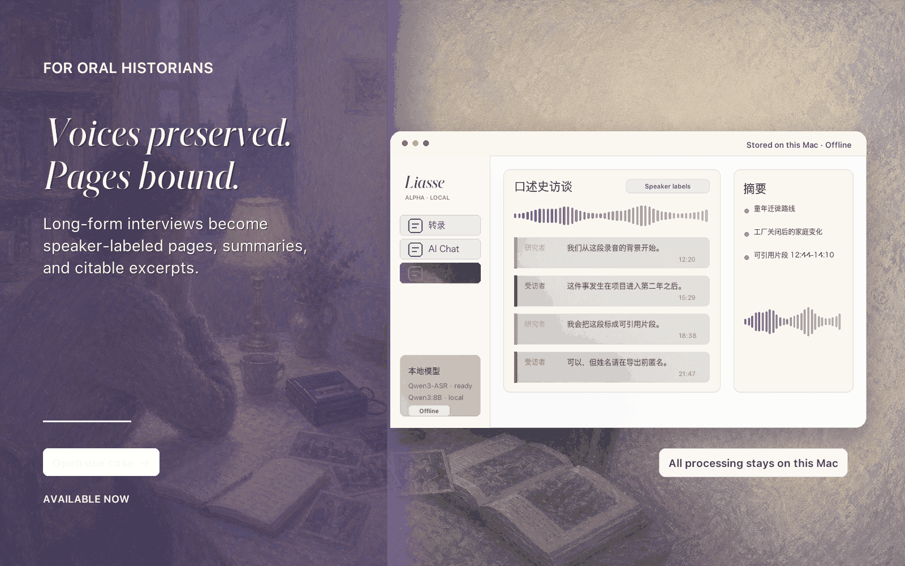
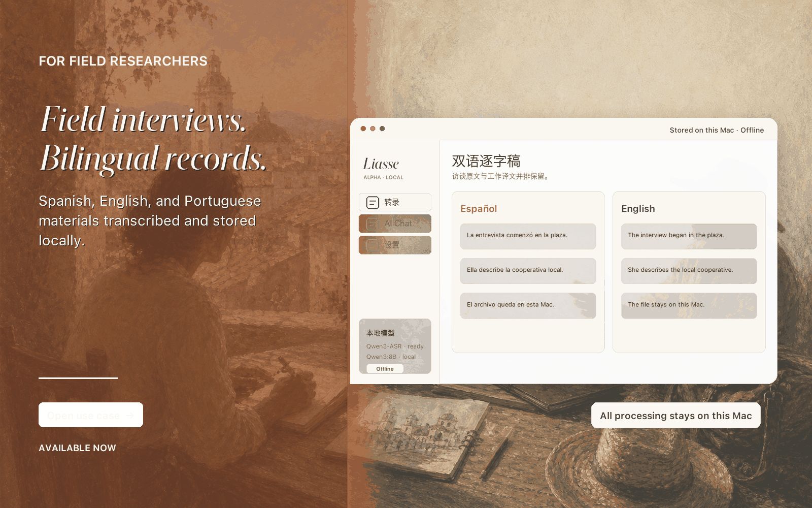
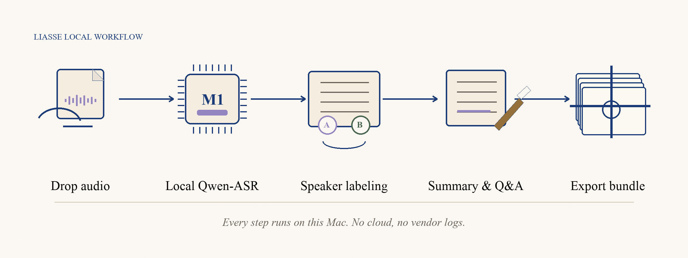

<p align="right">
  <strong>中文</strong> · <a href="README.en.md">English</a>
</p>

<p align="center">
  
</p>

<h1 align="center"><em>Liasse</em></h1>

<p align="center">
  <em>本地访谈转录工具。不上传云端，不调用第三方 API。</em>
</p>

<p align="center">
  <a href="#use-cases">使用场景</a> · <a href="#how-it-works">如何运作</a> · <a href="#quickstart">快速开始</a> · <a href="#agent-starter">AI Agent Starter</a> · <a href="#privacy">隐私</a>
</p>

---

> **Liasse**（法语，"一束被妥善收束起来的档案材料"）是一个把访谈录音变成可引用、可归档、不离开本机的逐字稿的桌面应用。
>
> 它的目标用户不是开发者，而是研究者、律师、合规官、口述史学者、田野调查者——任何手里有"不能上传"录音的人。

Liasse 不打算成为又一个"AI 录音工具"。它的形态参考的是研究者桌上那一束被丝带束起来的访谈材料：所有原件都在你这里，工具只是帮你把它们整理得更整齐。音频、逐字稿、总结、问答上下文，从下载模型那一刻起到导出 PDF，都不离开这台机器。

它在 **Apple Silicon Mac 上完全本地运行**——常见的 8GB MacBook Air 就够，16GB 是日常档，24GB+ 可上 1.7B ASR + Qwen3-8B 总结。**完全离线**开关一打开，连首次下载模型之外的所有网络调用都被禁用。

> 当前状态：alpha · 后端管线打通，桌面 UI 可用。

<a id="use-cases"></a>

## 使用场景

Liasse 的命名与形态来自 2026 年 5 月的一次多角色品牌调研——六个目标用户在同一个产品环境里给出了反馈与画像。下面是被那次调研抽出来的六种使用方式。

<table>
<tr>
<td width="50%" valign="top">
<a href="docs/assets/use-case-1-academic.png"></a>

**敏感访谈 · 学术研究**

可写进 Data Management Plan，符合 GDPR 与 IRB 审查；音频从不离开本机。

<sub>For academic researchers — Available now</sub>

</td>
<td width="50%" valign="top">
<a href="docs/assets/use-case-2-compliance.png"></a>

**合规与审计**

DMP-ready · audit-friendly · 没有任何环节走云端；输出 audit bundle，包含保留期限与本地处理日志。

<sub>For DPO &amp; IRB officers — Available now</sub>

</td>
</tr>
<tr>
<td width="50%" valign="top">
<a href="docs/assets/use-case-3-litigation.png"></a>

**庭前准备**

Privileged · confidential · 在你的机器上；笔录可作脚注引用，不进任何 vendor log。

<sub>For litigators — Available now</sub>

</td>
<td width="50%" valign="top">
<a href="docs/assets/use-case-4-paralegal.png"></a>

**批量案件管理**

数百小时录音按 matter number 编队列；导出 Markdown / SRT / JSON，整个流程本地。

<sub>For paralegals &amp; legal ops — Available now</sub>

</td>
</tr>
<tr>
<td width="50%" valign="top">
<a href="docs/assets/use-case-5-oralhistory.png"></a>

**口述史**

声音被保存，材料被装订。3-4 小时长访谈，多说话人精确标签，可作专著方法论引用。

<sub>For oral historians — Available now</sub>

</td>
<td width="50%" valign="top">
<a href="docs/assets/use-case-6-field.png"></a>

**田野研究 · 双语**

Bilingüe · 中 / 英 / 西多语言转录与本地保留，离线机器在田野也可用。

<sub>For field researchers — Available now</sub>

</td>
</tr>
</table>

> 这六种不是 hypothetical 场景——它们对应六个具体的画像（欧洲社科 PI、大学 DPO / IRB、美国诉讼律师、paralegal、口述史研究者、西语 / 拉美研究项目负责人）。每个画像都在调研里独立给 Liasse 打了最高分。

## 这不是一个"开发者工具"

Liasse 是一个**有 taste 的本地 LLM 产品**——目标是让任何人都能装、能用、能信任。但它也不是封闭黑盒：

- **默认即用** — 双击 `Start Liasse.command`，跑完安装就能转录。不需要懂 Python、不需要懂 ML。
- **可读可改** — 整个产品是 Python + Vue 3 CDN，没有 webpack、没有 npm 构建、没有 React 框架。任何懂一点点代码的人，加上一个 AI agent（Codex / Claude Code / Cursor），就能在半小时里把界面、文案、模型选型改成自己的样子。
- **零云依赖** — 一旦模型在本地，App 永远不联网。设置里的"完全离线"开关把 `HF_HUB_OFFLINE=1` 和 `TRANSFORMERS_OFFLINE=1` 都强制开启。

<a id="agent-starter"></a>

## AI Agent Starter

Liasse 故意保持小、可读、无构建步骤。你可以把仓库链接交给 Claude Code、Codex CLI 或 Cursor，让它在你的 Mac 上逐步检查环境、确认下载、启动应用。

先 clone：

```bash
git clone https://github.com/XEasonChan/Liasse.git
cd Liasse
```

然后把这段复制给 agent：

```text
请帮我在这台 Mac 上安装并启动 Liasse。

先阅读 AGENTS.md 和 ARCHITECTURE.md，再行动。目标是完成本地运行，不要改产品功能。

约束：
- 只使用 Python 3.12；venv 目录必须叫 venv/，不要创建 .venv/。
- 所有 shell 路径都要加引号，因为目录可能在 iCloud Drive 里。
- 可以检查 Homebrew、Python、ffmpeg、Ollama、模型缓存和磁盘空间。
- 需要安装系统依赖时，先告诉我要运行的 brew 命令。
- 需要下载大模型前先停下来确认。默认只准备 Qwen3-ASR-0.6B、Qwen3-ForcedAligner-0.6B 和 qwen3:4b。
- 不要默认下载 Qwen3-ASR-1.7B、qwen3:8b 或 pyannote；除非我明确同意。
- 不要替我写入、打印或覆盖 .env。需要 pyannote 时，提醒我准备 HF_TOKEN 并先接受 Hugging Face 模型许可。
- 不要擅自启动长期运行的 Ollama 守护进程；先询问我是用 ollama serve 还是 brew services start ollama。

完成后运行健康检查，并告诉我下一步怎么打开桌面应用。
```

默认安装会涉及这些本地模型：

| 用途 | 默认模型 | 体积 |
| --- | --- | ---: |
| 转录 | `Qwen/Qwen3-ASR-0.6B` | 约 1.2 GB |
| 时间戳对齐 | `Qwen/Qwen3-ForcedAligner-0.6B` | 约 1.3 GB |
| 总结 / 问答 | `qwen3:4b`（Ollama） | 约 2.5 GB |

可选模型：`Qwen/Qwen3-ASR-1.7B` 约 3.4 GB，`qwen3:8b` 约 5.2 GB，`pyannote/speaker-diarization-community-1` 约 600 MB 且需要 Hugging Face token 与许可确认。

<a id="privacy"></a>

## 隐私模型

Liasse 的隐私边界是「你的本机」：

- 音频文件不会上传到任何云转录 API。
- 逐字稿、总结、digest、问答历史保存在本地 `outputs/` 和 SQLite。
- 首次下载模型需要联网；下载完后开启「完全离线」模式即可永久断网运行。
- 不做 telemetry，不检查更新，不把任何材料发送给第三方服务。
- 模型推理全部在本机 Apple Silicon GPU（MLX / Metal）上完成。
- 错误日志和崩溃报告也只写到 `~/Library/Logs/Liasse/`，不上传。

<a id="how-it-works"></a>

## 如何运作

<p align="center">
  
</p>

五步，都在本机：

1. **拖入音频** — `mp3 / wav / m4a / flac / aac / ogg / wma / mp4`
2. **Qwen3-ASR 转录** — 默认 0.6B，质量模式可切 1.7B（Apple Silicon Metal GPU）
3. **说话人标记** — pyannote 4.x community-1，或更轻的 LLM 文本标记
4. **总结与 Q&A** — Ollama 本地 Qwen3:4b 或 8b
5. **导出 bundle** — Markdown / JSON / SRT；法律场景可走 PDF 打印模板

## 已有能力

| 模块 | 当前实现 |
| --- | --- |
| 桌面壳 | pywebview + 本地 FastAPI + Vue 3（无 npm 构建） |
| ASR | Qwen3-ASR-0.6B 默认，Qwen3-ASR-1.7B 可选 |
| 说话人识别 | pyannote 4.x `speaker-diarization-community-1` 或 LLM 文本标记 |
| 任务系统 | SQLite 持久化，队列串行执行，失败/中断可重试 |
| 多语言 UI | 中 · 英 · 西 |
| 总结 | Ollama 本地 Qwen3 生成 Markdown 总结 |
| Q&A / RAG | digest + 检索上下文 |
| 导出 | Markdown / JSON / SRT，PDF 走 `@media print` 模板 |
| 离线 | "完全离线"开关，强制 HF / Transformers 走本地缓存 |

## 硬件与内存

| 配置 | 说明 |
| --- | --- |
| **推荐最低** | Apple Silicon Mac，**8GB 统一内存**（常见于 MacBook Air）。可完成转录 + 4B 总结 / 问答；长访谈耗时会明显变长。 |
| **推荐日常** | **16GB**（MacBook Air / Pro、入门 iMac）。开发与实测主要在这一档。 |
| **更宽裕** | 24GB+。可安装 `qwen3:8b`、选用 1.7B ASR，质量更高。 |

不需要独立显卡或台式工作站。**不建议** Intel Mac、8GB 以下、或同时开很多浏览器标签 / 虚拟机的环境。

<a id="quickstart"></a>

## 快速开始

```bash
# 1. 系统依赖
brew install python@3.12 ffmpeg ollama

# 2. Hugging Face token（用于首次下载 pyannote 模型）
echo "HF_TOKEN=hf_xxx" >> .env
echo "PYANNOTE_AUTH_TOKEN=hf_xxx" >> .env

# 3. Python 环境
./Setup\ MLX\ Test\ Env.command

# 4. 本地总结 / 问答模型（8GB 机器只装 4B）
ollama pull qwen3:4b
# 可选：16GB+ 可加 8B
ollama pull qwen3:8b

# 5. 跑起来
ollama serve            # 单独终端
./Start\ Liasse.command  # 双击或命令行
```

`Start Liasse.command` 只检查 Ollama 在跑，不主动启动守护进程。

## 速度参考

Qwen3-ASR-0.6B + 说话人识别（约 0.6–0.7× 实时）：

| 音频长度 | 16GB | 8GB |
| --- | --- | --- |
| 60 秒 | ~90 秒 | ~1.5–2.5 分钟 |
| 5 分钟 | ~7–8 分钟 | ~10–15 分钟 |
| 30 分钟 | ~45 分钟 | ~1–1.5 小时 |
| 3 小时 50 分钟 | ~5–6 小时 | 建议过夜或分段 |

长音频目前是「整段重试」，未来计划切成 10-30 分钟段做局部 resume。

## 项目结构

代码组织参见 [ARCHITECTURE.md](ARCHITECTURE.md)；设计系统参见 [design.md](design.md)。

## Roadmap

- 长音频 chunking + 局部恢复
- 按时间段 / 说话人 / 主题的本地语义检索
- macOS App Bundle / DMG / 首次启动向导
- 暗色模式（v0.3）
- PDF 导出模板的法律 / 学术两种 preset

## 许可

本项目以 Apache License 2.0 发布。详见 [LICENSE](LICENSE)。

---

<p align="center">
  <sub><em>Liasse</em> · A research instrument that happens to be software.</sub>
</p>
