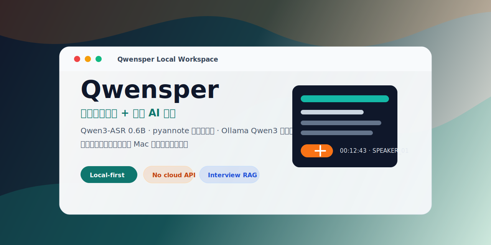
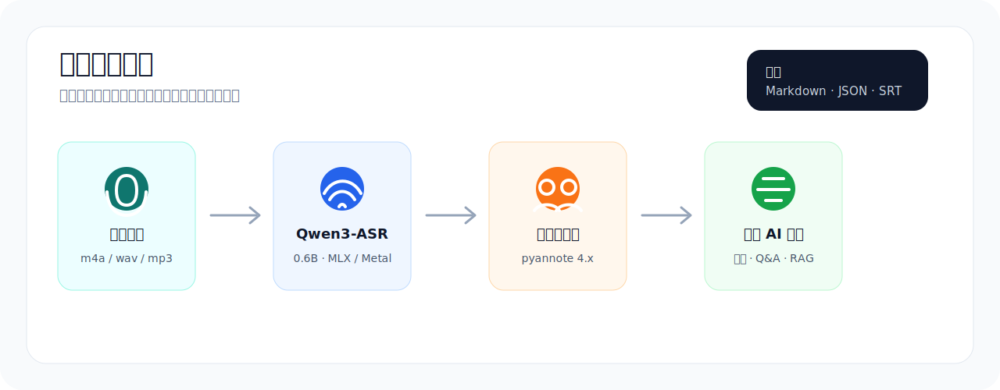
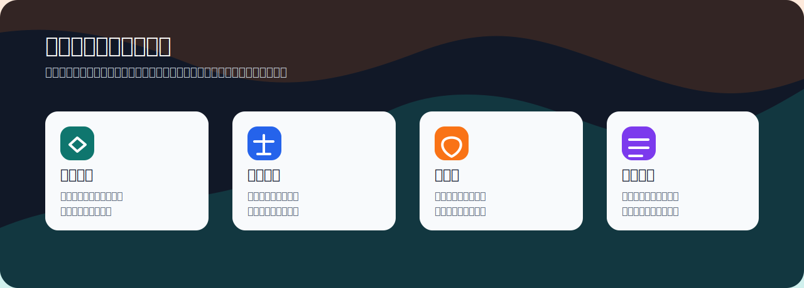

# Qwensper

<p align="center">
  
</p>

<p align="center">
  <a href="#中文">中文</a> · <a href="#english">English</a>
</p>

## 中文

Qwensper 是一个面向访谈研究、法律实务、口述史和高敏感资料整理的本地转录桌面应用。它把长音频转成带时间戳和发言人的逐字稿，并用本地 Qwen 模型完成总结、对话问答和轻量 RAG 检索。核心目标很朴素：敏感音频、逐字稿、摘要和问答上下文都不上传云端。

> 当前状态：alpha / research tool。后端管线已经跑通，桌面 UI MVP 可用。默认 ASR 使用 Qwen3-ASR-0.6B，Apple Silicon 上通过 MLX/Metal 本地推理。

## 为什么做这个

很多学术访谈、法律材料、咨询纪要和内部调查录音都不能丢给云端转录服务。Qwensper 的方向是把「转录 + 发言人识别 + 访谈总结 + 针对本次访谈的 AI 问答」放回研究者或专业工作者自己的电脑上：

- **本地优先**：ASR、发言人识别、总结和问答都在本机执行，不调用云 API。
- **适合长访谈**：面向 30 分钟到 4 小时级别的访谈音频，串行队列处理，避免 M1 16GB 机器爆内存。
- **可追溯导出**：输出 Markdown / JSON / SRT，保留时间戳、发言人和编辑后的文本。
- **本地 AI 分析**：通过 Ollama 调 Qwen3，生成摘要、结构化要点，并支持围绕当前访谈继续提问。
- **隐私控制**：设置中提供「完全离线」模式，强制 Hugging Face / Transformers 走离线缓存。

<p align="center">
  
</p>

## 已有能力

| 模块 | 当前实现 |
|---|---|
| 桌面壳 | `pywebview` 打开本地 FastAPI + Vue 3 UI |
| ASR | Qwen3-ASR-0.6B 默认，Qwen3-ASR-1.7B 作为高质量可选项 |
| 发言人识别 | pyannote 4.x `speaker-diarization-community-1` |
| 任务系统 | SQLite 持久化、队列串行执行、失败/中断后可重试 |
| 前端 | Vue 3 CDN，无 npm 构建；支持中 / 英 / 西 UI 语言 |
| 总结 | Ollama 本地 Qwen3 生成 Markdown 总结 |
| Q&A / RAG | 首次提问生成访谈 digest，后续问答基于 digest 和检索上下文 |
| 导出 | Markdown / JSON / SRT |
| 离线 | 完全离线开关，不上报 telemetry，不自动检查更新 |

## 适合谁

<p align="center">
  
</p>

- 学术研究者：访谈逐字稿、主题提取、后续编码前的材料整理。
- 法律和合规团队：敏感录音的本地转写、初步摘要和证据材料索引。
- 口述史 / 田野调查：多人访谈、长音频、发言人标签和时间戳。
- 企业内部研究：用户访谈、内部会议、不能外发的调研素材。

## 快速开始

目前主要面向 Apple Silicon macOS。

```bash
brew install python@3.12 ffmpeg ollama
```

准备 Hugging Face token，用于首次下载 pyannote 发言人识别模型：

```dotenv
HF_TOKEN=hf_xxx
PYANNOTE_AUTH_TOKEN=hf_xxx
```

安装 Python 环境和依赖：

```bash
./Setup\ MLX\ Test\ Env.command
```

下载本地总结 / 问答模型：

```bash
ollama pull qwen3:4b
# 可选：更高质量但更占内存
ollama pull qwen3:8b
```

启动 Ollama 后打开桌面应用：

```bash
ollama serve
./Start\ WhisperQwen.command
```

`Start WhisperQwen.command` 只检查 Ollama 是否在运行，不会擅自启动守护进程。

## 使用流程

1. 选择音频文件或文件夹，支持 `mp3 / wav / m4a / flac / aac / ogg / wma / mp4`。
2. 选择本次任务参数：是否发言人识别、人数、是否总结、ASR 模型、音频语言。
3. 任务进入本地队列，后台串行转录。
4. 打开任务详情，编辑逐字稿、重命名发言人、查看总结。
5. 在右侧 Q&A 面板围绕当前访谈提问。
6. 导出 Markdown / JSON / SRT。

## 隐私模型

Qwensper 的隐私边界是「你的本机」：

- 音频文件不会上传到云端转录 API。
- 逐字稿、总结、digest、问答历史保存在本地 `outputs/` 和 SQLite。
- 首次下载模型需要联网；下载完成后可开启「完全离线」。
- 不做 telemetry，不检查更新，不把材料发送到第三方服务。

## 速度参考

M1 16GB，Qwen3-ASR-0.6B + 发言人识别：

| 音频长度 | 估算耗时 |
|---|---|
| 60 秒 | 约 90 秒 |
| 5 分钟 | 约 7-8 分钟 |
| 30 分钟 | 约 45 分钟 |
| 3 小时 50 分钟 | 约 5-6 小时 |

长音频目前是「从头重试」，不是 chunk checkpoint resume。后续计划把音频预切成 10-30 分钟段，以便更细粒度进度、失败恢复和检索。

## 项目结构

```text
launch_app.py                     # pywebview 入口：启动 FastAPI 并打开桌面窗口
Start WhisperQwen.command         # 双击启动
local_transcriber/
├── web_app.py                    # FastAPI REST + SSE
├── task_runner.py                # 后台任务队列
├── web_models.py                 # SQLite / SQLAlchemy / Pydantic 模型
├── chat.py                       # 总结、digest、Q&A / RAG
├── pipeline.py                   # ASR → diarization → summary → export 编排
├── asr.py / diarization.py / alignment.py
├── exporters.py                  # Markdown / JSON / SRT
└── web_static/                   # Vue 3 前端，无构建步骤
docs/
├── frontend-spec.md
├── dev-plan.md
└── assets/                       # README 展示图
tests/
```

## 开发命令

环境检查：

```bash
./Check\ Runtime.command
```

单元测试：

```bash
venv/bin/python -m pytest tests/ -v
```

60 秒样本端到端测试：

```bash
venv/bin/python scripts/run_test_audio.py --seconds 60 --diarize --num-speakers 2
```

## Roadmap

- 长音频 chunking：更细进度、局部失败恢复、未来支持分块 RAG。
- 0.6B / 1.7B ASR 质量评估：建立中文、英文、粤语访谈样本评测。
- 更完整的本地检索：按时间段、发言人、主题和关键词召回片段。
- 更稳的打包分发：macOS app bundle / DMG / 首次启动向导。

## 许可

暂未选择开源许可证。请先不要把它当作可自由再分发的软件使用。

---

## English

Qwensper is a local-first desktop app for interview transcription and private AI analysis. It is designed for academic research, legal work, oral history, internal research, and other workflows where audio recordings and transcripts are too sensitive to send to a cloud transcription service.

It turns long recordings into timestamped, speaker-aware transcripts, then uses local Qwen models for summaries, interview Q&A, and lightweight local retrieval. The core promise is simple: sensitive recordings, transcripts, summaries, and chat context stay on your own machine.

> Status: alpha / research tool. The backend pipeline is already working, and the desktop UI MVP is usable. The default ASR model is Qwen3-ASR-0.6B running locally on Apple Silicon through MLX / Metal.

## Why This Exists

Researchers, lawyers, compliance teams, and fieldworkers often handle recordings that should not be uploaded to third-party services. Qwensper brings the full workflow back onto the user’s Mac:

- **Local-first**: ASR, diarization, summaries, and Q&A all run locally. No cloud API is used for core processing.
- **Built for long interviews**: Handles 30-minute to 4-hour recordings through a serial task queue that is friendly to M1 16GB machines.
- **Traceable exports**: Exports Markdown, JSON, and SRT with timestamps, speaker labels, and edited text.
- **Local AI analysis**: Uses Ollama-hosted Qwen models to generate summaries, structured digests, and task-specific Q&A.
- **Privacy controls**: Includes a fully offline mode that forces Hugging Face / Transformers to use local cache only.

## Current Capabilities

| Area | Current implementation |
|---|---|
| Desktop shell | `pywebview` running a local FastAPI + Vue 3 app |
| ASR | Qwen3-ASR-0.6B by default, with Qwen3-ASR-1.7B planned as a higher-quality option |
| Speaker diarization | pyannote 4.x `speaker-diarization-community-1` |
| Task system | SQLite persistence, serial queue, retry after failure or interruption |
| Frontend | Vue 3 via CDN, no npm build step; English / Chinese / Spanish UI |
| Summary | Local Qwen through Ollama generates Markdown summaries |
| Q&A / RAG | First question builds an interview digest; later answers use the digest plus locally retrieved transcript snippets |
| Export | Markdown / JSON / SRT |
| Offline mode | No telemetry, no update checks, local-cache-only option |

## Who It Is For

- Academic researchers: interview transcripts, theme extraction, and material preparation before coding.
- Legal and compliance teams: local transcription of sensitive recordings with timestamped references.
- Oral history and fieldwork: long recordings, multiple speakers, speaker labels, and archival exports.
- Internal research teams: user interviews, internal meetings, and non-shareable research material.

## Quick Start

Qwensper currently targets Apple Silicon macOS.

```bash
brew install python@3.12 ffmpeg ollama
```

Create a Hugging Face token for the first pyannote diarization model download:

```dotenv
HF_TOKEN=hf_xxx
PYANNOTE_AUTH_TOKEN=hf_xxx
```

Install the Python environment and dependencies:

```bash
./Setup\ MLX\ Test\ Env.command
```

Download a local model for summaries and Q&A:

```bash
ollama pull qwen3:4b
# Optional: higher quality, more memory
ollama pull qwen3:8b
```

Start Ollama, then open the desktop app:

```bash
ollama serve
./Start\ WhisperQwen.command
```

`Start WhisperQwen.command` only checks whether Ollama is already running. It does not start the daemon automatically.

## Workflow

1. Select audio files or a folder. Supported formats: `mp3 / wav / m4a / flac / aac / ogg / wma / mp4`.
2. Choose task options: speaker diarization, number of speakers, summary generation, ASR model, and audio language.
3. The task enters a local serial queue and runs in the background.
4. Open the task detail view to edit transcripts, rename speakers, and read the summary.
5. Ask questions about the current interview in the right-side Q&A panel.
6. Export Markdown, JSON, or SRT.

## Privacy Model

Qwensper’s privacy boundary is your own machine:

- Audio files are not uploaded to a cloud transcription API.
- Transcripts, summaries, digests, and chat history are stored locally under `outputs/` and SQLite.
- The first model download requires network access; after that, fully offline mode can be enabled.
- No telemetry, no automatic update checks, and no third-party processing service.

## Performance Reference

M1 16GB, Qwen3-ASR-0.6B + speaker diarization:

| Audio length | Estimated runtime |
|---|---|
| 60 seconds | About 90 seconds |
| 5 minutes | About 7-8 minutes |
| 30 minutes | About 45 minutes |
| 3 hours 50 minutes | About 5-6 hours |

Long recordings currently retry from the beginning rather than resuming from a chunk checkpoint. A future chunking layer should enable finer progress, partial recovery, and stronger retrieval.

## Project Structure

```text
launch_app.py                     # pywebview entry: starts FastAPI and opens the desktop window
Start WhisperQwen.command         # double-click launcher
local_transcriber/
├── web_app.py                    # FastAPI REST + SSE
├── task_runner.py                # background task queue
├── web_models.py                 # SQLite / SQLAlchemy / Pydantic models
├── chat.py                       # summary, digest, Q&A / RAG
├── pipeline.py                   # ASR → diarization → summary → export orchestration
├── asr.py / diarization.py / alignment.py
├── exporters.py                  # Markdown / JSON / SRT
└── web_static/                   # Vue 3 frontend, no build step
docs/
├── frontend-spec.md
├── dev-plan.md
└── assets/                       # README visuals
tests/
```

## Development

Runtime check:

```bash
./Check\ Runtime.command
```

Unit tests:

```bash
venv/bin/python -m pytest tests/ -v
```

60-second end-to-end smoke test:

```bash
venv/bin/python scripts/run_test_audio.py --seconds 60 --diarize --num-speakers 2
```

## Roadmap

- Long-audio chunking for finer progress, partial recovery, and chunk-level RAG.
- 0.6B / 1.7B ASR quality evaluation on Chinese, English, and Cantonese interview samples.
- Richer local retrieval by timestamp, speaker, topic, and keyword.
- More robust macOS packaging: app bundle, DMG, and first-run setup wizard.

## License

No open-source license has been selected yet. Please do not treat this as freely redistributable software for now.
